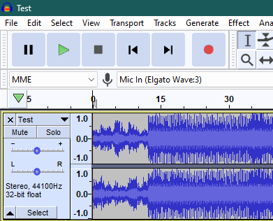

## Audacity Steps

In this quick segway, we'll be using Audacity to export our music to an MP3 format for the game to use.

While this guide focuses on Audacity, you should be good to follow along with any half-decent audio editing software.

1. Open Audacity and import your music of choice.

2. Export as an MP3 file by going to **File** > **Export** > **Export as MP3**

3. Use the following settings:
   * Export the audio file to the location where bf2-sound-import is extracted to for ease of access.
   * Name the exported file to any name you wish; for this example we will be using **TestMP3** as the name.
   * Set the **bit rate mode** to **Constant**.
   * Pick a Quality of choice (e.g., 320kbps).
   * Export!

You should now have a newly-created MP3 file that the game can play without issues... sort of.

Before adding it to the game, we'll first convert this new MP3 file to an **EALAYER3** file that the game can recognize.

[Click here to continue with the main guide!](https://github.com/KingJackSkellington/nfs-rivals-custom-music/blob/main/README.md#bf2-sound-importdandev-el3exe-steps)

