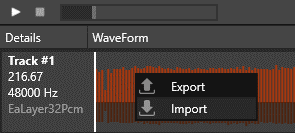
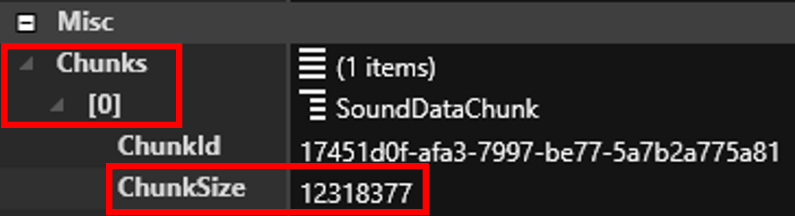
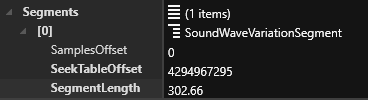
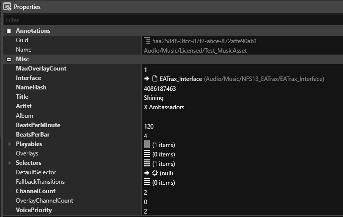
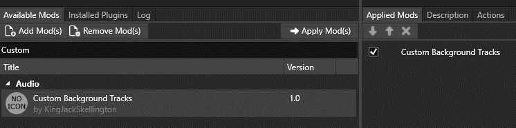

# Custom Music Integration for Need for Speed Rivals!

In this guide, we'll be taking our favorite music and importing it to Need for Speed Rivals via Frosty Editor and Frosty Mod Manager.

This guide is designed with complete beginners in mind, hand-holding the reader every step of the way. If you're skilled enough at Frosty Editor and simply want a quick summary of what do, [click here!](https://github.com/KingJackSkellington/nfs-rivals-custom-music/blob/main/Quick%20Summary.md)

-----

## Tools Required

- (Optional) **Audio Editing Software** (in the event that your audio file isn't an MP3, [follow this quick guide](https://github.com/KingJackSkellington/nfs-rivals-custom-music/blob/main/Audacity%20Steps.md) to convert your music of choice into an MP3 file.)
- **[bf2-sound-import](https://github.com/DanielElam/bf2-sound-import/releases)** (Download FrostySoundImport-1.3.3.3.zip and extract the files "**dandev-el3.exe**" and "**libmpg123-0.dll**" from the .zip file to a new folder)
- **[Frosty Editor](https://github.com/CadeEvs/FrostyToolsuite/releases)** (Download the FrostyEditor.zip file and extract its contents to a new folder)
- **[Frosty Mod Manager](https://github.com/CadeEvs/FrostyToolsuite/releases)** (Download the FrostyModManager.zip file and extract its contents to a new folder)

---

## bf2-sound-import/dandev-el3.exe Steps

1. Open File Explorer and navigate to the folder where you have **dandev-el3.exe and libmpg123-0.dll** extracted to.
   

2. Open a Command Prompt window by typing **cmd** into the navigation bar in File Explorer and hitting Enter on the keyboard.
   

   

3. Run the command: dandev-el3.exe inputfile (replace inputfile with the file name of the exported Audacity audio).
   * *Example: dandev-el3.exe TestMP3.mp3*
   * Note 1: If your file has a space in its title, use quotation marks around the filename on the command ("Test MP3.mp3", for example.)
   * Note 2: If your file is not in the same location as the dandev-el3.exe, simply drag-and-drop it into the Command Prompt and it will automatically generate the name alongside its location (dandev-el3.exe "F:\Audio Import\TestMP3.mp3", for example)

4. A **new file** with the **.ealayer3 extension** will appear, this new file is what we will be importing to Frosty Editor.
   * *Example: TestMP3.ealayer3*
   * Note the results for **ChunkSize** and **SegmentLength** that the tool gives here, as we will need these values later.

Now that we have the EALAYER3 file, we'll be importing this file into the game, and those **ChunkSize** and **SegmentLength** values will come in handy soon.

---

The following Frosty Editor steps are divided into three parts to focus on three files that we will be modifying:

- a duplicated SoundWaveAsset file (which will contain our imported EALAYER3 file),
- a duplicated MusicAsset file (which handles various properties of our new music that the Frostbite engine reads), and
- a FreedrivePlaylist file (which handles the playlist for songs that play during free drive; more on this later on.)

NOTE: Any changes that we do while on Frosty Editor are completely temporary, so there's no risk of damaging any game files.

---

## Frosty Editor pt. 1 - SoundWaveAsset

- Note: refer to this video to set-up Frosty Editor for the first time: https://www.youtube.com/watch?v=i2PceQ1-sJI&t=54s

- The chapters "Setting up Frosty Editor", "Locating your game manually", and "Brief editor overview" are the only ones you need to watch to get a quick overview of Frosty Editor.
1. Once you have set up Frosty Editor, navigate to Audio\Music\Licensed in the Data Explorer.
   

2. On the bottom left, the files that are in the Licensed folder will appear. Right-click on a SoundWaveAsset file and click on Duplicate, and rename the duplicated file to the new track.
   * *Example: Test*

3. Open the newly-duplicated SoundWaveAsset file by double-clicking on the file, then right-click on the WaveForm and click on Import.
   

   

   * Here, navigate to where the **.ealayer3 file** is located and import this file.
   * *Example: TestMP3.ealayer3*

4. In the properties of the file on the right side, expand the **Chunks** property, expand the **[0]** entry, and validate that the **ChunkSize** value here **matches** the ChunkSize value from the bf2-sound-import results on the Command Prompt window. If not, input that value here.
   * Example: ChunkSize: 12318377

5. In Selection, make sure that the value SoundWaveVariationSelection_Random is chosen. If not, click on this value and from the dropdown pick this value.
   

6. Expand the Segments property, and expand the [0] entry:
   
   * If the **SamplesOffset** value is **anything other than 0**, edit the value and set it to 0.
   * If the **SeekTableOffset** has a value of **0**, edit the value and set it to the following value: **4294967295**
   * Edit the **SegmentLength** value with the SegmentLength value from the bf2-sound-import results on the Command Prompt window.
   * *Example: SegmentLength: 302.66*
   

Now that we have the audio file in the game, we'll need to point the Frostbite Engine to the right direction: our new audio. That's where the duplicated MusicAsset will come in!

---

## Frosty Editor pt. 2 - MusicAsset

1. In the Data Explorer, navigate to Audio\Music\Licensed and duplicate a **MusicAsset** file, rename it to the new track, and add/keep the **_MusicAsset** suffix.
   * *Example: Test_MusicAsset*

2. Double click on **Test_MusicAsset** to open the newly-duplicated MusicAsset file.
   

3. Modify the NameHash to a **unique 10-digit numerical value**. (or just mash your numpad until you get 10 digits.)
   
   * *Example: 1111111111*

4. Edit the **Title** and **Artist** values accordingly; the title and artist will show up in-game.
   
   * *Example: Title/Artist*
   

5. Expand the **Playables** property, open **[0]**:
   
   * Under **Id** and **Name**, paste the name of the custom MusicAsset.
     

   
   * Highlight the custom SoundWaveAsset on the Data Explorer, then on the **Wave** property click the right arrow to paste the SoundWaveAsset name here.
     

6. Expand the **Selectors** property, open **[0]**, and expand the **Target** sub-entry:
   
   * Under **Id** and **Name**, paste the name of the custom MusicAsset.
     

So at this point, you should have the custom SoundWaveAsset file and a new MusicAsset file, but the game won't play our new music until we tell it where in the game to play it!

-----

NFS: Rivals has three playlists that handle music:

- one playlist for when you're on free roam (FreedrivePlaylist, which will be the focus of this tutorial),
- one playlist for races (RacePlaylist), and
- one "playlist" for pursuit music (the pursuit music is its own system, located at Audio\Music\Pursuit)

Finally, we'll be editing one final file to get our music into the rotation. Almost there!

---

## Frosty Editor pt. 3 - FreedrivePlaylist

1. Under Audio\Music\Licensed, open the **FreedrivePlaylist** file.
   

2. On the **Assets** property, hit the **X** icon to delete all the entries that are previously there.
   
   * The items under Assets contain the original soundtrack, which we will remove in its entirety.
     

3. While on the **Assets** property, hit the **+** icon to add a new item to the list, and expand the Assets property.
   
   * When adding more music, simply hit the + icon on Assets to add more items as needed.
     

     

4. On the Data Explorer, click on our Test_MusicAsset once to highlight it, then on the [0] entry click the right arrow to add the Test_MusicAsset file to this list!
   

   

-----

## Saving the project files

We now have all the necessary files imported and modified to send it over to Frosty Mod Manager.
Before we do anything else, let's save this project so that you can come back and keep modifying these files:

- Go to File > Save, name it however you wish, save it somewhere safe and hit Save.
  

  

-----

## Exporting to Frosty Mod Manager

Now that the project is saved, we'll export these modified files into a mod file that Frosty Mod Manager uses to apply mods.

- Go to File > Export to Mod

- Fill out the required information, and save to a location of choice, preferrably wherever you have Frosty Mod Manager extracted.
  
  - Note: while only the first field is mandatory to fill out, fill out as much of this information as you can if you plan on releasing any mod in general.
  

  

-----

## Applying the Mod

Time to finally add your music to the game! If you haven't set-up Frosty Mod Manager yet, now's the time to do so.

Just like when setting up Frosty Editor, add Rivals to the list either by "Scan for games" or manually adding the game to the list, and double-click on the game.

Click on "Add Mods" and select the **exported .fbmod file** from Frosty Editor.

Click "Apply Mods" to apply the mod, and hit Launch!

Go in free roam, and voila!

Enjoy your music!
